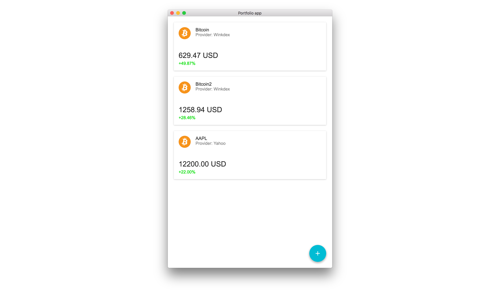

What is Portfolio App?
#############

Portfolio App is a program for keeping an eye on your current investments.  The program automatically updates prices and shows you the value of your investments, their change etc.

Development Roadmap
===================

Checkpoints
-----------

- [x] View for adding new investments.
- [ ] More providers (e.g. Avanza etc.)
- [ ] Saving and loading investments/portfolios.

Ideas
-----
- Sync portfolio between computer/phone (maybe cloud storage for portfolios?)

Built with
==========
- *Electron*
- *NodeJS*
- *React*
